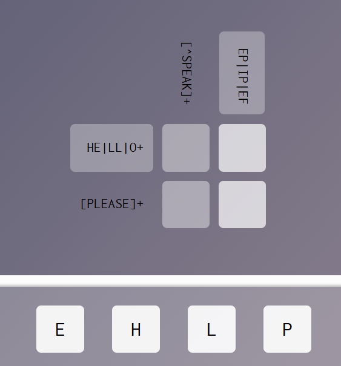
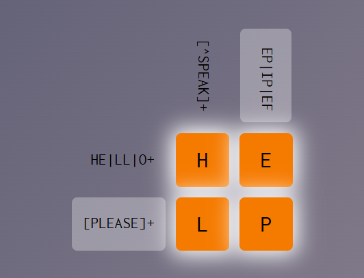
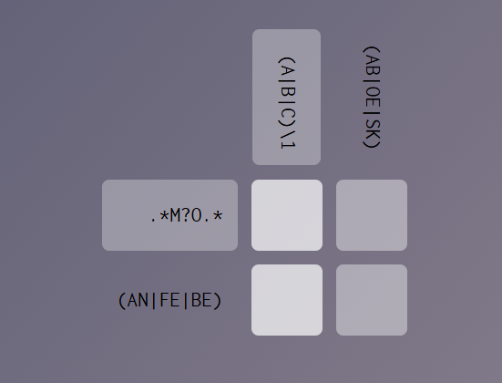
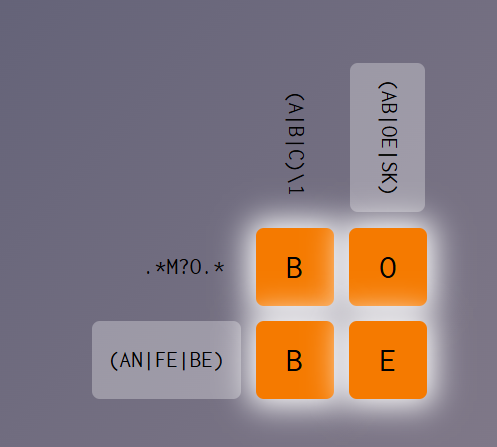
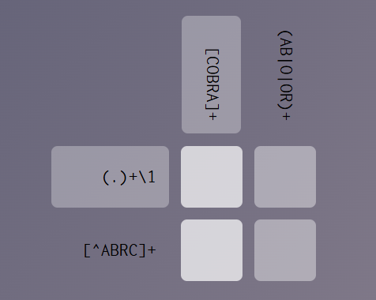
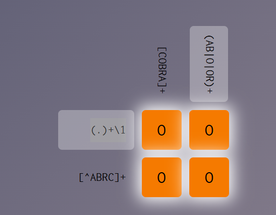
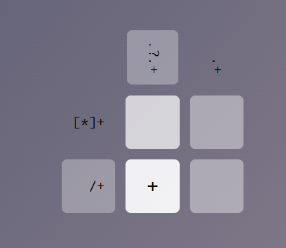
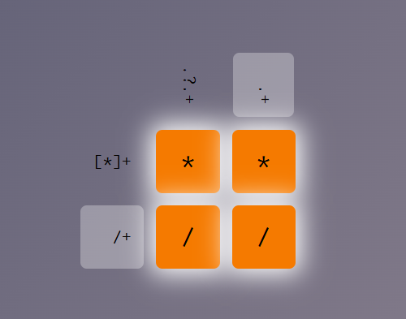
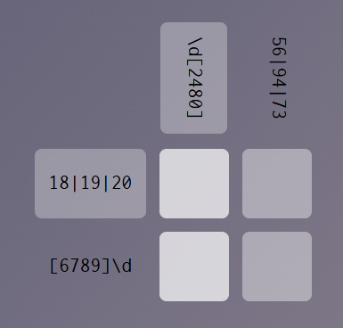

# Problemas


## Exercicio 1 (beatles)



**Letras: EHLP**

- 1:1
HE|LL|O+  = HE | LL
[^SPEAK]+ = HL

Para satisfazer as duas linhas tem que ser H
- 1:2
HE|LL|O+ = HE | LL
EP|IP|EF =  EP

E é a unica opção possível que satisfaz ambos os cenários. HE e EP

- 2:1
[^SPEAK]+ = HL
[PLEASE]+ = ELP

Para satisfazer as duas partes, temos L

- 2:2

[PLEASE]+ = ELP
EP|IP|EF  = EP

Dado que (1:2) possui a letra E. Então 

```regex

               ([^SPEAK]+)      ([^SPEAK]+)
(HE|LL|O+)        
([PLEASE]+)
```



## Exercicio 2 (Naughty)



**Letras : BEO**

- 1:1
.*M?O.* = 
(A|B|C)\1 = BB

Os valores precisam se repetir, então só cabe BB na coluna
- 1:2
.*M?O.* = O
(AB|OE|SK) = OE

Os * são para 0 ou mais e ? para 0 ou 1. Então Não precisam existir. Unico garantido é o O.

- 2:1
(A|B|C)\1 = BB
(AN|FE|BE) = BE

Os valores precisam se repetir logo é B.

- 2:2
(AN|FE|BE) = BE
(AB|OE|SK) = OE

Para que ambos sejam satisfeitos nesse caso temos a letra E



## Exercicio 3 (Ghost)



**Letras: ABCOR**

- 1:1
(.)+\1   = Qualquer valor repetido
[COBRA]+ = Todos

Pela segunda coluna ser é O, aqui deve ser O tbm.
- 1:2
(.)+\1     = 
(AB|O|OR)+ = 

Esse valor vai precisar se repetir com o da coluna anterior. Unico que pode se repetir é o O.

- 2:1
[^ABRC]+ = O
[COBRA]+ = Todos

Aqui só pode ser a letra O
- 2:2
[^ABRC]+   = O
(AB|O|OR)+ = O, OR

Pra satisfazer os dois precisa ser O.



## Exercicio 4 (Symbolism)



Letras: * + . /

- 1:1
[*]+ = *+
.?.+ = *+

Precisa começar com *, e o wildcard acaba não existindo
- 1:2
[*]+ = 
.+   = 

Precisa ser um conjunto repetido de *. Portanto tbm *
- 2:1
/+   = /+
.?.+ = 

Nesse caso vai ser o / e abaixo vai ser o +
- 2:2
/+ = /+
.+ =  qualquer coisa + \+

Me perdi


Ele sume que a resposta é / /. Mas eu me perdi nos operadores + sendo simbolo ou sendo ação do regex.

## Exercicio 5 (AirStrip One)



Letras: 0 1 4 6 8 9

- 1:1
18|19|20 = 18
\d[2480] = .8 ou .0

Unico digito que combina com os valores possiveis no segundo elemento sendo 8 ou 0, é 18 e 20
- 1:2
18|19|20 = 18 | 20
56|94|73 = ??

- 2:1
[6789]\d = 94
\d[2480] = 94

- 1:2
[6789]\d = 73 | 94
56|94|73 = 94 | 73

